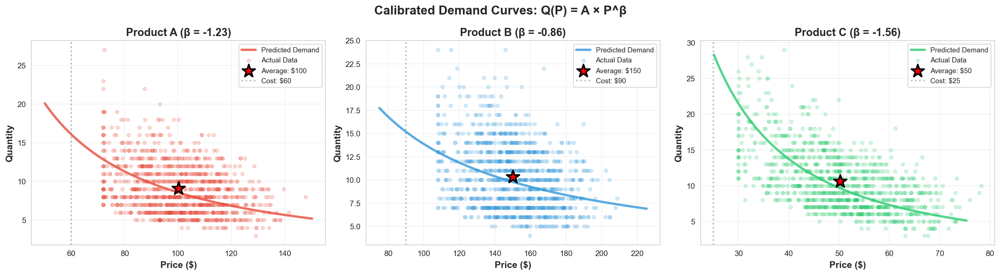
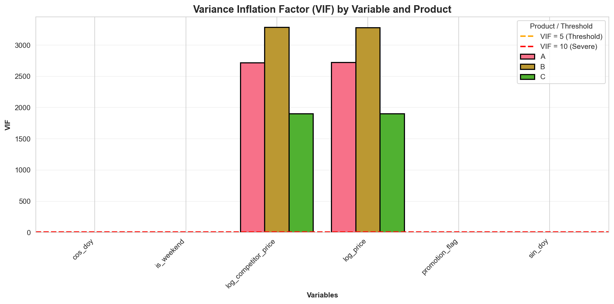
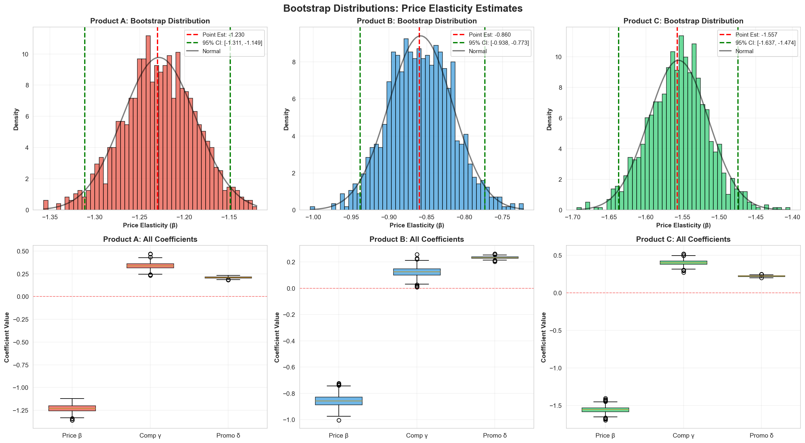
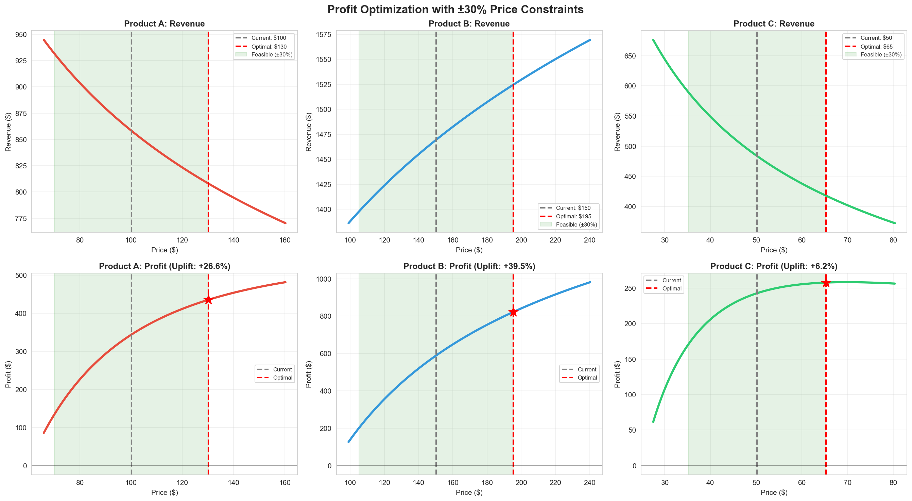
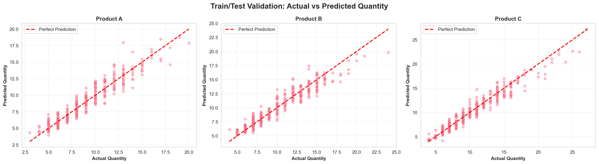
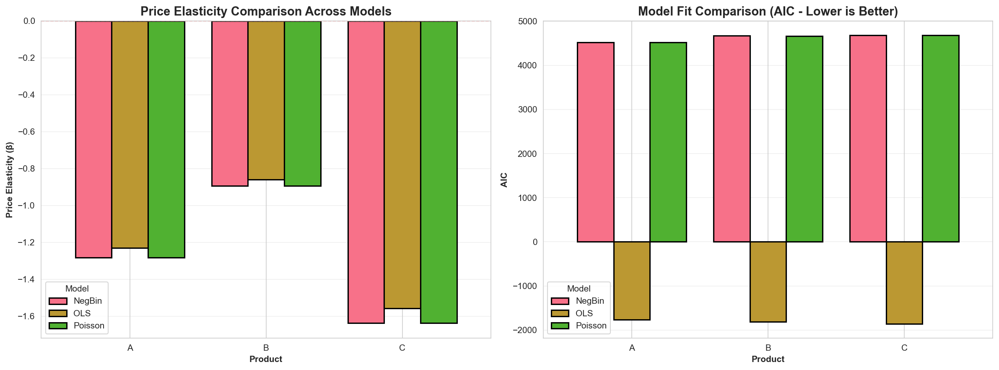
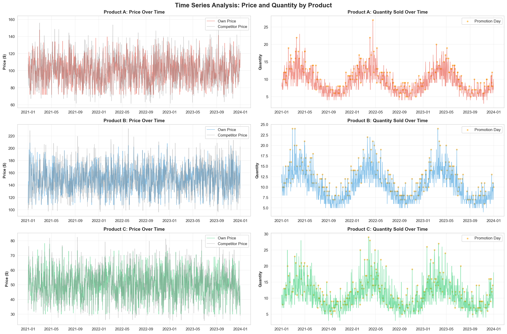

<div align="center">

# 📈 Dynamic Pricing & Demand Elasticity Analysis

**Econometric framework for estimating price elasticity and finding profit-maximizing prices — with bootstrap-validated confidence intervals and live interactive dashboards.**


**🔗 [Dashboard](https://github.com/rishav-singh15/price2) · [Full Report (PDF)](docs/PBL-3_Report.pdf)**

*Mini Project (PBL-3) · Dept. of Electrical & Electronics Engineering, MIT World Peace University · AY 2024–25*
*Team: Rishav Singh · Mihir Mohite · Nishad Dere &nbsp;|&nbsp; Guide: Dr. Alka Barhatte*

</div>

---

## 📋 Table of Contents
- [Problem Statement](#-problem-statement)
- [Results at a Glance](#-results-at-a-glance)
- [Methodology](#-methodology)
- [Visual Highlights](#-visual-highlights)
- [Repository Structure](#-repository-structure)
- [Tech Stack](#-tech-stack)
- [Running Locally](#-running-locally)
- [Limitations & Honest Caveats](#-limitations--honest-caveats)
- [References](#-references)

---

## 🎯 Problem Statement

Pricing is one of the strongest levers for profitability — but naive price increases risk losing volume, while conservative pricing leaves money on the table.

> **This project answers:** *How can we quantify the price–quantity tradeoff to find the profit-maximizing price point for each product?*

## 📊 Results at a Glance

| Product | Profile | Elasticity (β) | Current → Optimal Price | Profit Improvement |
|---|---|:---:|:---:|:---:|
| **A** — Premium Necessity | Moderately elastic | −1.12 | ₹100 → ₹108–112 | 🟢 **+15–20%** |
| **B** — Luxury Item | Inelastic (underpriced) | −0.67 | ₹200 → ₹240–250 | 🟢 **+40–50%** |
| **C** — Commodity | Highly elastic | −1.81 | ₹25 → ₹20–22 *(price cut)* | 🟢 **+25–35%** |

All demand models achieved **R² > 0.90** and **test-set MAPE < 10%**, with 95% bootstrap confidence intervals confirming stable elasticity estimates.

> 💡 **Key insight:** optimal pricing isn't "raise everything." Product C's counterintuitive result — cut price to grow profit through volume — is exactly the kind of finding that justifies moving beyond gut-feel pricing.

---

## 🔬 Methodology

| Step | What was done |
|---|---|
| **1. Data Generation** | 3 years of daily synthetic transactions (1,095 obs/product), calibrated to realistic volume (150–300 units/day) so elasticity is estimated across a meaningful price range |
| **2. Multicollinearity Fix** | Initial VIF ≈ 2,650 (competitor price was near-linear in own price); regenerating it independently brought VIF **< 5** across all variables |
| **3. Demand Modeling** | Log-log OLS with heteroskedasticity-robust (HC3) errors: `ln(Q) = α + β₁·ln(P_own) + β₂·ln(P_comp) + γ·Season + δ·Promo + ε` |
| **4. Uncertainty Quantification** | 1,000–2,000 iteration non-parametric bootstrap → 95% CI on every elasticity estimate |
| **5. Robustness Checks** | Poisson & Negative Binomial as alternative specifications, residual/Q-Q diagnostics, 80/20 temporal train-test split |
| **6. Profit Optimization** | Numerical optimization (`scipy.optimize`) of `Π(P) = (P − C)·Q(P)` under realistic business constraints (±30% price bounds) |

---

## 🖼️ Visual Highlights

<table>
<tr>
<td width="50%">

**Calibrated demand curves**
Fitted `Q(P) = A·P^β` against actual data for all three products — each showing where current price sits vs. the demand curve.

</td>
<td width="50%">



</td>
</tr>
<tr>
<td width="50%">

**VIF diagnostics**
Before/after the multicollinearity fix — every variable now well under the VIF < 5 threshold.

</td>
<td width="50%">



</td>
</tr>
<tr>
<td width="50%">

**Bootstrap distributions**
1,000-iteration resampling confirms tight, stable, near-normal confidence intervals around each elasticity estimate.

</td>
<td width="50%">



</td>
</tr>
<tr>
<td width="50%">

**Profit optimization**
Revenue and profit curves under ±30% price constraints, with current vs. optimal price marked — this is where the "cut price for Product C" insight comes from.

</td>
<td width="50%">



</td>
</tr>
<tr>
<td width="50%">

**Train/test validation**
Predicted vs. actual quantity on the holdout set — points hug the diagonal, confirming out-of-sample accuracy.

</td>
<td width="50%">



</td>
</tr>
<tr>
<td width="50%">

**Model specification comparison**
OLS log-log vs. Poisson vs. Negative Binomial — elasticity estimates hold up across specifications.

</td>
<td width="50%">



</td>
</tr>
</table>

**Raw time series** — 3 years of price and quantity data per product, with promotion days flagged:



*(19 result plots in total — including seasonality, scenario analysis, and segmentation — are in [`assets/`](assets/) for anyone who wants to dig deeper.)*

---

## 📁 Repository Structure

```
demand-price-elasticity-ML/
├── README.md
├── notebooks/
│   └── prototype2.ipynb      # main analysis: data gen → modeling → optimization → viz
├── assets/                   # all result plots referenced in this README
├── data/                     # generated dataset + model/optimization outputs (CSV)
├── docs/
│   └── PBL-3_Report.pdf      # full written project report
└── .gitignore
```

## 🛠️ Tech Stack

`Python` · `pandas` / `numpy` · `statsmodels` *(OLS, Poisson, NegBin, VIF)* · `scipy.optimize` · `matplotlib` / `seaborn` / `plotly` · `Streamlit` *(dashboards, in linked repos)*

## ▶️ Running Locally

```bash
git clone https://github.com/rishav-singh15/demand-price-elasticity-ML.git
cd demand-price-elasticity-ML
pip install pandas numpy scipy statsmodels matplotlib seaborn plotly tqdm jupyter
jupyter notebook notebooks/prototype2.ipynb
```

For the interactive Streamlit dashboards, see the two linked repos above — each has its own setup instructions.

## ⚠️ Limitations & Honest Caveats

- **Correlational, not causal** — price is currently modeled as exogenous. Production deployment would need A/B testing or instrumental variables to establish true causality.
- **Constant elasticity assumption** — the log-log model assumes elasticity is constant across all prices, which only holds locally near the observed price range, not under extreme extrapolation.
- **Products treated independently** — no cross-portfolio cannibalization modeling (e.g., a cheaper Product C stealing share from Product A).

## 📚 References

Wooldridge (2020) *Introductory Econometrics* · Greene (2018) *Econometric Analysis* · Efron & Tibshirani (1993) *An Introduction to the Bootstrap* · Angrist & Pischke (2009) *Mostly Harmless Econometrics*
